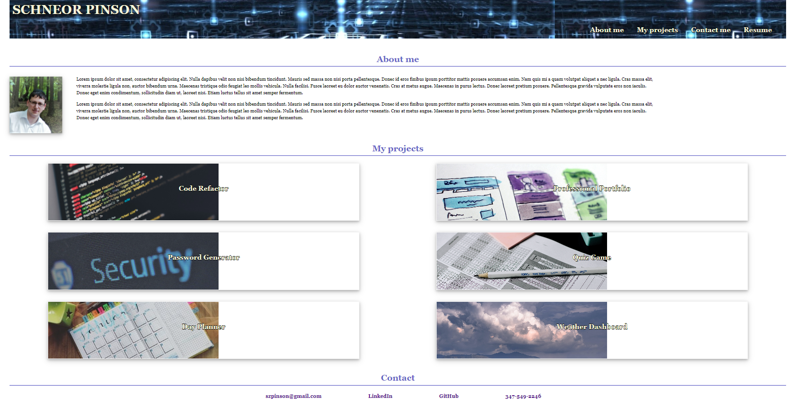

# MyPortfolio

## Goal:

Create a webpage the represent who i am and what my project are. it will have the following:

1. My name and contact info.
2. A profile picture.
3. A brief description about me.
4. A card for each project i created with a link to the coresponding GitHub page.

## Links:

Live link:
https://zpinson.github.io/MyPortfolio

GitHub link:
https://github.com/zpinson/MyPortfolio

## Screen shot:
